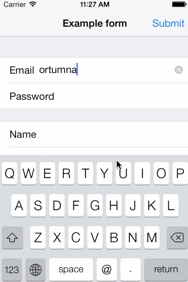

SwiftForms
==========

Purpose
-------
SwiftForms is a powerful and extremely flexible library written in Swift that allows to create forms by just defining them in a couple of lines. It also provides the ability to customize cells appearance, use custom cells and define your own selector controllers.

#####Here is an screenshot from an example application using SwiftForms



How to create a form
--------------------

Creating a form using SwiftForms is pretty straightforward. All you need is to derive your controller from `FormViewController` and define a `FormDescriptor` instance along with its sections and rows. Here is an example of how to create a simple form to input an email and a user password. 

```swift

// Create form instace 
let form = FormDescriptor()
form.title = "Example form"

// Define first section
let section1 = FormSectionDescriptor()

var row: FormRowDescriptor! = FormRowDescriptor(tag: "name", rowType: .Email, title: "Email")
section1.addRow(row)

row = FormRowDescriptor(tag: "pass", rowType: .Password, title: "Password")
section1.addRow(row)

// Define second section
let section2 = FormSectionDescriptor()

row = FormRowDescriptor(tag: "button", rowType: .Button, title: "Submit")
section2.addRow(row)

form.sections = [section1, section2]

self.form = form
```
To see a more complex form definition you can take a look to the example application.

Cell appearance
----------------------

Every row descriptor has a cellConfiguration dictionary which allows to customize cell appearance by defining its subviews property values using key-value coding.

```swift
row.cellConfiguration = ["titleLabel.font" : UIFont.boldSystemFontOfSize(30.0), "segmentedControl.tintColor" : UIColor.redColor()]
```

Custom cells
-----------------

In addition, it is possible to create 100% custom cells by deriving from `FormBaseCell` class. In that case, don't forget to override `configure` and `update` methods. First method will be called only once and after cell has been created, and the second one every time cell content should be refreshed.

Here are the methods that help you to define custom cell behavior.
```swift
func configure() {
    /// override
}
    
func update() {
    /// override
}
    
class func formRowCellHeight() -> CGFloat {
    return 44.0
}
    
class func formViewController(formViewController: FormViewController, didSelectRow: FormBaseCell) {
}
```
Once you have defined your custom cell, and in order to use it for a concrete row, you'll have to set `FormRowDescriptor` cellClass property.

Custom selector controllers
-------------------------------------

In order to customize selector controller your class should conform to `FormSelector` protocol. That way you'll have access to the cell instance that pushed the controller, being able to alter its properties or setting it's row value accordingly to user interaction. 

After defining your class, don't forget to set `FormRowDescriptor` selectorControllerClass property to use your custom selector controller.

Requirements
---------------------

* iOS 7.0 and above

Installation
---------------------
Swift projects is currently not supported by Cocoapods. Until support is available you should just clone the repository and drag the source folder into your project to use SwiftForms. 

Copyright
---------

SwiftForms is originally based on XLForm github project. (https://github.com/xmartlabs/XLForm)

Check LICENSE file for more details.

Contact
-------

If you are using SwiftForms in your project and have any suggestion or question:

Miguel Angel Ortuño, <ortuman@gmail.com>

[@ortuman](http://twitter.com/ortuman)

